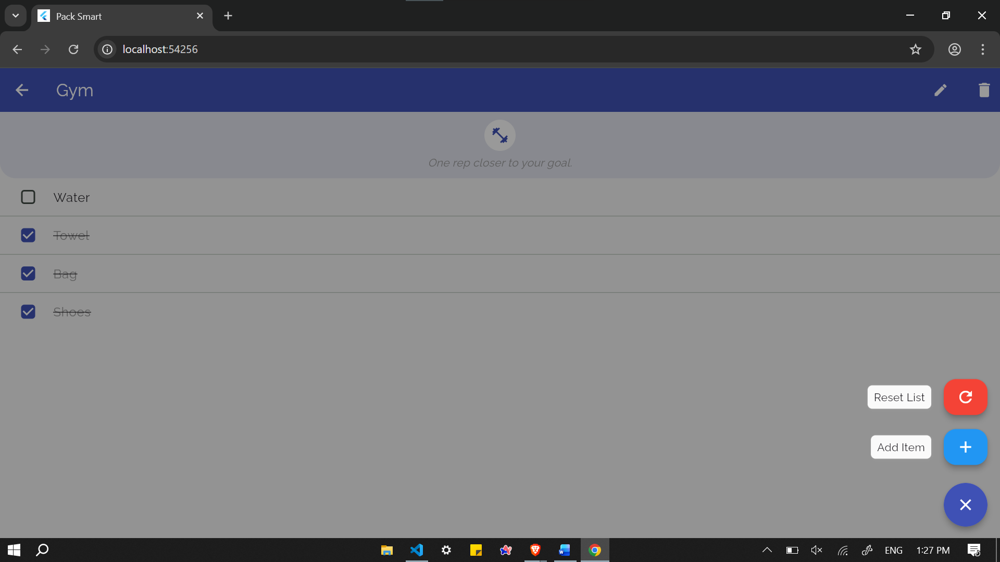
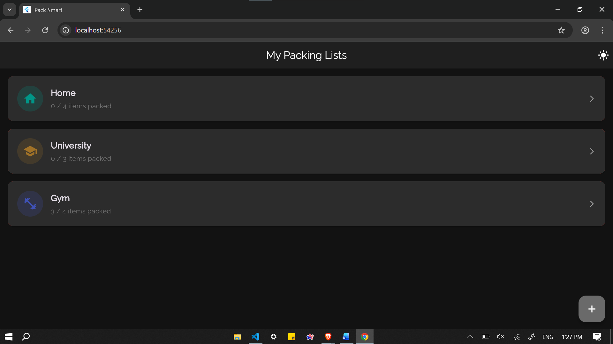
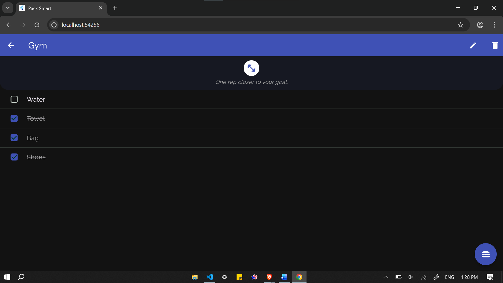
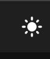
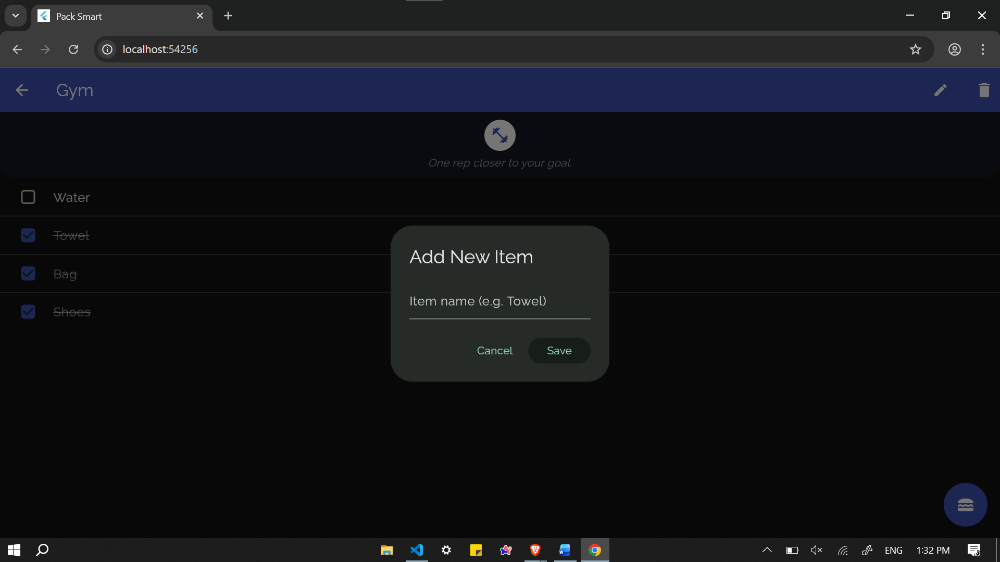

# Packing Assistant (Pack Smart)

**Personal Note**
Am creat această aplicație pentru a-mi ușura procesul de împachetare înainte de călătorii. Pentru mine e important să nu uit lucruri esențiale, iar cand am inceput sa călătoresc mai des, am simțit nevoia unei aplicații simple și eficiente care să mă ajute să organizez bagajele. In special in drumurile dintre casa si facultate, unde trebuia să împachetez rapid și să nu uit nimic important. De multe ori am patiti să uit lucruri esențiale in urma, iar această aplicație a fost soluția perfectă pentru mine. Sper să fie la fel de utilă și pentru tine!

**Packing Assistant** (cunoscută in aplicație ca "Pack Smart") este o aplicație mobilă dezvoltată în Flutter, creată pentru a te ajuta să îți organizezi bagajele eficient, indiferent de destinație. Fie că pleci într-o vacanță exotică, la munte sau pur și simplu la sală, aplicația îți permite să gestionezi liste de verificare personalizate ca să nu uiți nimic important.


## 📱 Funcționalități Principale

### 1. Gestionarea Listelor (Categorii)
*   **Creare Liste Personalizate**: Poți crea categorii noi de împachetat (de exemplu: "Vacanță Vară", "City Break", "Sală").
*   **Personalizare Vizuală**: Alege dintr-o gamă variată de **icoane** și **culori** pentru a identifica ușor fiecare listă.
*   **Citate Inspiraționale**: Fiecare categorie vine cu un citat tematic ("Home is where your story begins", "Adventure awaits", etc.) în funcție de iconița aleasă.


### 2. Checklist-uri Inteligente
*   **Adăugare Obiecte**: Adaugă rapid obiecte în listă (ex: "Pașaport", "Încărcător", "Haine").
*   **Progres**: Bifează obiectele pe măsură ce le pui în bagaj.
*   **Editare**: Poți redenumi listele sau obiectele existente.
*   **Ștergere Multiplă**: Mod dedicat pentru a șterge rapid mai multe obiecte din listă.


### 3. Teme (Dark Mode & Light Mode)
*   Aplicația suportă **Dark Mode** și **Light Mode**.
*   Se adaptează automat la setările sistemului sau poate fi comutată manual din setări.
*   Design modern folosind specificațiile **Material Design 3**.




### 4. Salvare Automată
*   Datele tale sunt salvate local pe dispozitiv. Nu vei pierde listele dacă închizi aplicația.

---

## 🚀 Cum funcționează?

### Ecranul Principal (Home)
Aici vezi toate categoriile tale de liste.
*   **Adaugă o listă nouă**: Apasă butonul `+` (Floating Action Button). Vei putea alege:
    *   Titlul listei.
    *   O culoare distinctivă.
    *   O iconiță reprezentativă.
*   **Accesează o listă**: Apasă pe cardul categoriei dorite pentru a vedea detaliile.
*   **Șterge o categorie**: Ține apăsat pe un card sau folosește opțiunea de ștergere (dacă este disponibilă în UI). 
*   **Schimbă Tema**: Folosește comutatorul din Bară (AppBar) sau setări pentru a trece pe modul Întunecat/Luminos. , 

### Ecranul Listă (Checklist)
Odată intrat într-o categorie:
*   **Adaugă un obiect**: Apasă butonul `+` și scrie numele obiectului. 
*   **Bifează**: Atinge caseta din dreptul obiectului când l-ai împachetat. Obiectul se va muta la finalul listei sau se va marca vizual.
*   **Șterge obiecte**: Activează modul de ștergere (dacă există un meniu dedicat sau swipe) pentru a elimina lucruri inutile.

---

## 🛠️ Detalii Tehnice

Aplicația este construită folosind **Flutter** și include următoarele pachete și tehnologii:
*   **Limbaj**: Dart
*   **Stocare Locală**: `shared_preferences` (pentru salvarea listelor și a preferinței de temă).
*   **Fonturi**: `google_fonts` (folosește fontul *Raleway*).
*   **UI Components**: Utilizare extensivă a widget-urilor Material 3 (`Card`, `FloatingActionButton`, `SliverAppBar` etc.).
*   **State Management**: `setState` și `ValueNotifier`.

## 📦 Instalare și Rulare

Dacă ești dezvoltator și vrei să rulezi proiectul:

1.  Asigură-te că ai Flutter instalat.
2.  Clonează acest repository.
3.  Deschide un terminal în folderul proiectului.
4.  Instalează dependențele:
    ```bash
    flutter pub get
    ```
5.  Rulează aplicația:
    ```bash
    flutter run
    ```

